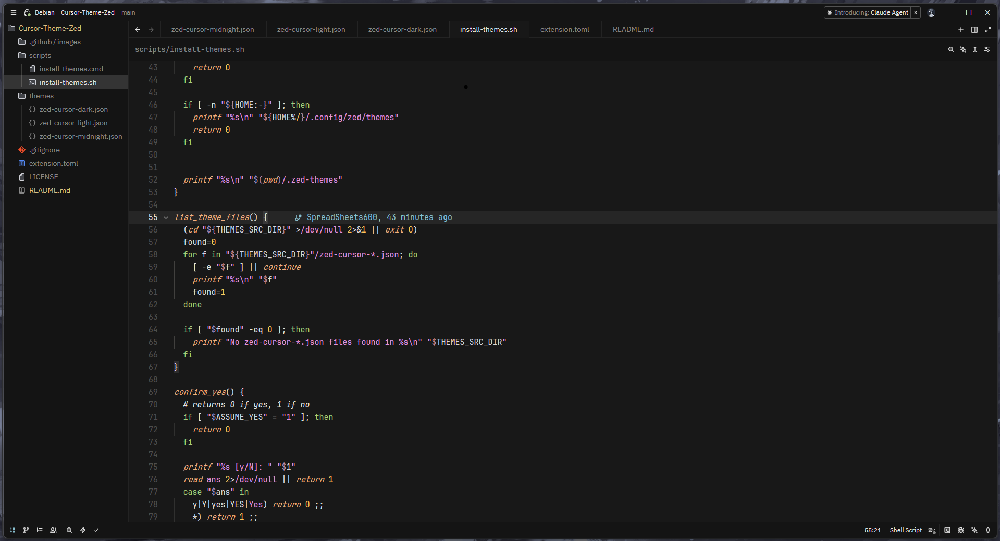
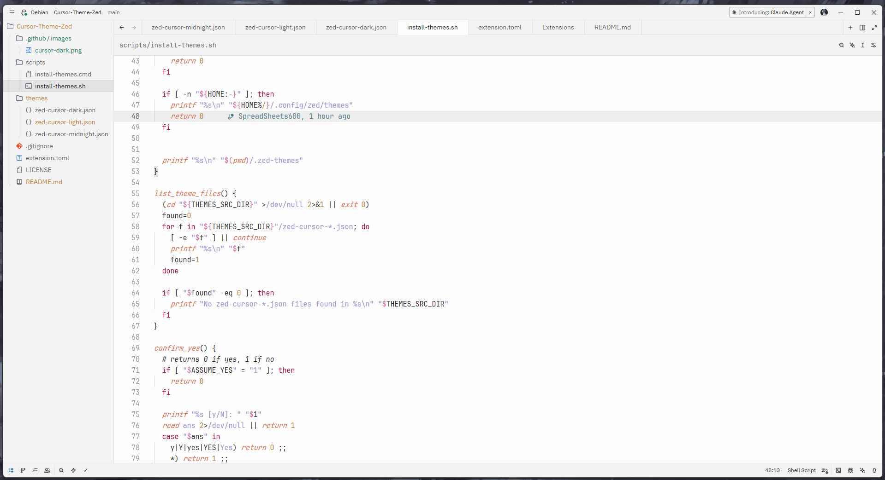
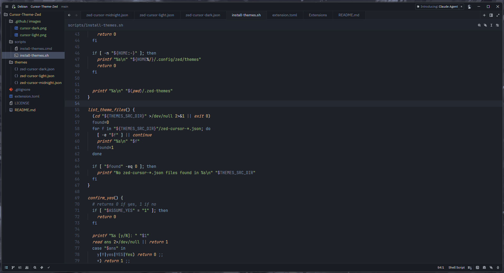

# Cursor Style Theme For Zed

This repository provides color themes for the Zed editor. The themes are JSON files in `themes/` that can be installed into your local Zed themes folder and selected from Zed's Theme Selector.

## Included Themes

- [Cursor Dark](./themes/zed-cursor-dark.json)
- [Cursor Light](./themes/zed-cursor-light.json)
- [Cursor Midnight](./themes/zed-cursor-midnight.json)

## Screenshots





## Quick Summary

- Install directly from the repository using the provided install scripts:
    - `scripts/install-themes.sh` (macOS/Linux)
    - `scripts/install-themes.cmd` (Windows CMD)
- Or clone the repository and run the installer locally.
- You can also copy files manually from `themes/` into Zed's themes directory.

## Supported Platforms and Default Destination

- Linux/macOS: `$HOME/.config/zed/themes` (or `$XDG_CONFIG_HOME/zed/themes` if set)
- Windows: `%APPDATA%\Zed\themes`

## Install from Latest Repository (curl/wget)

### macOS/Linux (curl)

```bash
curl -fsSL https://raw.githubusercontent.com/SpreadSheets600/cursor-theme-zed/main/scripts/install-themes.sh | bash -s -- --yes
```

### macOS/Linux (wget)

```bash
wget -qO- https://raw.githubusercontent.com/SpreadSheets600/cursor-theme-zed/main/scripts/install-themes.sh | bash -s -- --yes
```

### Windows (CMD)

Uses the `.cmd` installer in this repository:

```bash
curl -fL "https://raw.githubusercontent.com/SpreadSheets600/cursor-theme-zed/main/scripts/install-themes.cmd" -o "%TEMP%\install-themes.cmd" && "%TEMP%\install-themes.cmd" -y
```

## Install by Cloning the Repository

1. Clone the repository:

```bash
git clone https://github.com/SpreadSheets600/cursor-theme-zed.git
cd cursor-theme-zed
```

2. Run the installer for your platform.

macOS/Linux:

```bash
./scripts/install-themes.sh

# Non-interactive:
./scripts/install-themes.sh --yes

# Install to a custom directory:
./scripts/install-themes.sh --dest "$HOME/.config/zed/themes"
```

Windows (CMD):

```bash
scripts\install-themes.cmd

# Non-interactive:
scripts\install-themes.cmd -y

# Dry-run (show actions without copying):
scripts\install-themes.cmd -n
```

## Notes

- The `--yes` / `-y` flag makes installation non-interactive and overwrites existing files.
- On supported platforms, overwriting creates timestamped backups.
- To review actions first, omit `--yes` / `-y` for interactive mode, or use:
    - `--list` (shell)
    - `-n` (Windows CMD dry-run)

## After Installation

- Restart Zed (or open the Theme Selector) and choose the new theme(s).
- If a theme does not appear, confirm the JSON files are in the correct Zed themes directory and restart Zed.

## Credits / Acknowledgements

- Inspired by and adapted from the VS Code Cursor theme by Udit:
    - https://github.com/udit-001/cursor-theme-vscode
- Thanks to Udit (`udit-001`) for the original theme work and ideas.

## License

See `LICENSE` for license details.
